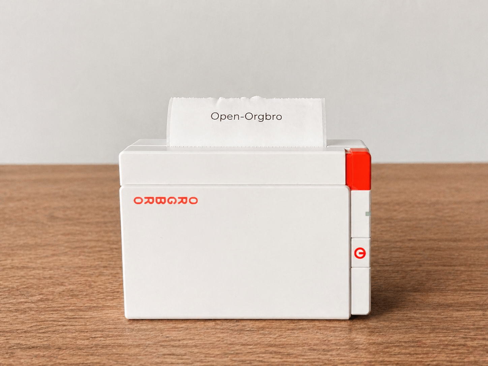

# ORGBRO X3 Gmail Printer

Print incoming Gmail messages on an ORGBRO X3 thermal printer over Bluetooth Low Energy.

When a new unread email arrives, the listener fetches the sender, date, subject, and body, renders the message as a 1-bit raster image, prints it on the X3, then marks the email as read and labels it `X3-Printed`.



## Privacy Model

This repository does not include real OAuth credentials, Gmail tokens, logs, email content, local file paths, printer addresses, or personal sample data.

Each user must create their own Google Cloud OAuth credentials locally. Runtime files are ignored by Git:

- `etc/gmail-credentials.json`
- `etc/gmail-token.json`
- `etc/gmail_listener_state.json`
- `logs/`
- `captures/`
- `labels/`

## Requirements

- Python 3.11+
- macOS with Bluetooth
- ORGBRO X3 powered on
- Snap & Tag app closed while printing
- A Google Cloud project with Gmail API enabled
- Optional: Cloud Pub/Sub API for real-time Gmail notifications

## Install

```bash
git clone REPOSITORY_URL Open-Orgbro-GMAIL
cd Open-Orgbro-GMAIL
python3 -m venv .venv
source .venv/bin/activate
pip install -r requirements.txt
```

## Google Setup

1. Open the Google Cloud Console.
2. Create or select a project.
3. Enable Gmail API.
4. Create OAuth client credentials for a Desktop app.
5. Download the JSON file.
6. Save it locally as `etc/gmail-credentials.json`.

The committed `etc/gmail-credentials.example.json` only shows the expected shape:

```json
{
  "installed": {
    "client_id": "YOUR_OAUTH_CLIENT_ID.apps.googleusercontent.com",
    "client_secret": "YOUR_OAUTH_CLIENT_SECRET",
    "redirect_uris": ["http://localhost"],
    "auth_uri": "https://accounts.google.com/o/oauth2/auth",
    "token_uri": "https://oauth2.googleapis.com/token"
  }
}
```

## First Run

The first run opens a browser for OAuth consent. After authorization, the local token is saved to `etc/gmail-token.json`.

```bash
source .venv/bin/activate
python3 scripts/gmail_listener.py --poll-interval 30
```

The polling mode checks unread mail every 30 seconds. It does not require Pub/Sub.

## Real-Time Mode

For real-time notifications, enable Cloud Pub/Sub API and create a topic/subscription:

```bash
gcloud pubsub topics create gmail-notifications --project=YOUR_PROJECT_ID

gcloud pubsub subscriptions create gmail-listener-sub \
  --topic=gmail-notifications \
  --project=YOUR_PROJECT_ID

gcloud pubsub topics add-iam-policy-binding gmail-notifications \
  --project=YOUR_PROJECT_ID \
  --member="serviceAccount:gmail-api-push@system.gserviceaccount.com" \
  --role="roles/pubsub.publisher"
```

Then run:

```bash
python3 scripts/gmail_listener.py --watch --project-id YOUR_PROJECT_ID
```

You can also set:

```bash
export GOOGLE_CLOUD_PROJECT=YOUR_PROJECT_ID
python3 scripts/gmail_listener.py --watch
```

## Print Text Manually

```bash
python3 scripts/q2_print_text.py "Hello world" --height-rows 120 --font-size 64
```

Preview without printing:

```bash
python3 scripts/q2_print_text.py "Hello world" \
  --height-rows 120 \
  --font-size 64 \
  --preview /tmp/x3-preview.png \
  --preview-only
```

## LaunchAgent Template

`com.orgbro.gmail-printer.plist.example` is a template. Copy it outside the repository or generate a local version with absolute paths for your machine.

Do not commit the generated plist if it contains local paths.

## Bluetooth Notes

BLE printing usually works best from Terminal.app because macOS grants Bluetooth permissions per app. The optional local bundle `tools/X3Python.app` can be used as a private wrapper for CoreBluetooth permissions, but it is not part of this repository.

## File Layout

```text
scripts/
  gmail_listener.py   Gmail -> print orchestrator
  q2_print_text.py    text -> raster -> BLE print
  x3_ble.py           shared ORGBRO X3 BLE helpers
etc/
  gmail-credentials.example.json
  gmail-credentials.json       local only, gitignored
  gmail-token.json             local only, gitignored
  gmail_listener_state.json    local only, gitignored
logs/
  local only, gitignored
```

## License

MIT
